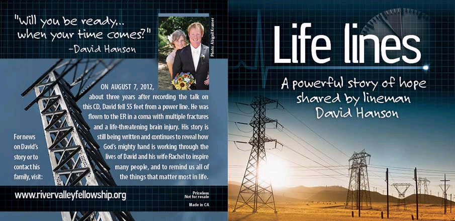

<!DOCTYPE html PUBLIC "-//W3C//DTD XHTML 1.0 Strict//EN"
"http://www.w3.org/TR/xhtml1/DTD/xhtml1-strict.dtd">

<html>
<head>

   <title>Life Lines CD - David Hanson</title>
</head>

<table width="100%" border="0" cellspacing="5" class="boxText">
<tr>
    <td colspan="2" align="left">

 

<h1>Life Lines CD - David Hanson</h1>

 

(CD IS ALSO KNOWN AS "WILL YOU BE READY WHEN YOUR TIME COMES?" BEFORE ARTWORK WAS REMADE AFTER THE ACCIDENT)

 

 

<h1>ORDERING INFORMATION</h1>
</h4><ul>  

<li>STORY: For David's story, which is still being told please click "David Hanson's Story" above.</li>  
<li>ORDERING: CD's are now available! Please fill out form below to order. </li> 
 <li>COST: <b>THERE IS NO CHARGE FOR THIS CD</b>. If you wish to donate to help cover costs, there is a link at the bottom of this page where you can do so. A link and mailing address are provided after you submit the order. <b>If you can't afford to give a donation, please order anyway. The Lord will provide.</b></li>
<li>SHIPPING: We are willing to ship these out to the address you provide (no charge). Otherwise, to save us the shipping costs you can pick up if you are near Sacramento, CA or Chippewa Falls, WI. </li>
<li>LISTEN:</li> To listen to David's CD online, please click <a href="http://www.rivervalleyfellowship.org/audio/2012/willyoubeready.wma" target="_blank" >HERE.</a></li>
<li>QUESTIONS: Please call 715.450.1534 or e-mail natejhanson@gmail.com  </li>

  

<!DOCTYPE html PUBLIC "-//W3C//DTD XHTML 1.0 Strict//EN"
"http://www.w3.org/TR/xhtml1/DTD/xhtml1-strict.dtd">

<table width="100%" border="0" cellspacing="5" class="boxText">
<tr>
    <td colspan="2" align="left">

Powered byEMF <a style="text-decoration:none;" href="http://www.emailmeform.com/" target="_blank">Online HTML Form</a>

<b>There is no charge for the CD.</b> The message is priceless. However, if you wish to donate to help David's family with covering costs you may do so via the paypal link below, or mail a check to: River Valley Christian Fellowship 516 Bridgewater Ave. Chippewa Falls, WI 54729. Thank you for your support and for taking this opportunity to spread the priceless message of God's Word! 

<!-- The amounts indicated below are a ballpark figure so you know approximately what it would be to cover our costs depending how man cd's you would like.

<td><input type=radio name="FieldData4" value="1 ($1)" id="radio40"><label for="radio40">1 ($1) </label>
 <input type=radio name="FieldData4" value="10 for $10" id="radio41"><label for="radio41">10 for $10 </label>
 <input type=radio name="FieldData4" value="25 for $20" id="radio42"><label for="radio42">25 for $20</label>
 <input type=radio name="FieldData4" value="50 for $40" id="radio43"><label for="radio43">50 for $40</label>
 <input type=radio name="FieldData4" value="100 for $75" id="radio43"><label for="radio43">100 for $75</label>

-->
<form action="https://www.paypal.com/cgi-bin/webscr" method="post">
<input type="hidden" name="cmd" value="_s-xclick">
<input type="hidden" name="encrypted" value="-----BEGIN PKCS7-----MIIHTwYJKoZIhvcNAQcEoIIHQDCCBzwCAQExggEwMIIBLAIBADCBlDCBjjELMAkGA1UEBhMCVVMxCzAJBgNVBAgTAkNBMRYwFAYDVQQHEw1Nb3VudGFpbiBWaWV3MRQwEgYDVQQKEwtQYXlQYWwgSW5jLjETMBEGA1UECxQKbGl2ZV9jZXJ0czERMA8GA1UEAxQIbGl2ZV9hcGkxHDAaBgkqhkiG9w0BCQEWDXJlQHBheXBhbC5jb20CAQAwDQYJKoZIhvcNAQEBBQAEgYDA16olDAjih6bxj0r/qKP+o4Licd8sQ9PLY3bU9jl1gXIhP2dPOnDPvDm6IGtSyUgG+LkdO0g4ZbZM5Hivb1l01sjma3viQu+j3QiADy/VM+fQ3bLVBWkzzuRSkauSKLDAuGAnA16Y0/3yGDSoJlDgfMLIm8nr606vXmVGRoU8OjELMAkGBSsOAwIaBQAwgcwGCSqGSIb3DQEHATAUBggqhkiG9w0DBwQIxiD3HbBA0yOAgaiWe+3cDr8zGHaQVpXwKTxkiSqVIjAQ1kCQ18ZBt0RFVlbTAwwha5XooeK7JiEPCyWpmTJavFHNelIYxKHjJgxYRNptGmTuztThZbP8sxC7+S8zq/o/KVd3sN6JzXLqnYWLTHVrvLSWJrpvwStI3He1JAUqdOsRVb5zia4r5ob44GjV/5IWAftAF65rY3dh8h53ruNnAQ06hPfPGX/MUAJiWp9iZZ+TybWgggOHMIIDgzCCAuygAwIBAgIBADANBgkqhkiG9w0BAQUFADCBjjELMAkGA1UEBhMCVVMxCzAJBgNVBAgTAkNBMRYwFAYDVQQHEw1Nb3VudGFpbiBWaWV3MRQwEgYDVQQKEwtQYXlQYWwgSW5jLjETMBEGA1UECxQKbGl2ZV9jZXJ0czERMA8GA1UEAxQIbGl2ZV9hcGkxHDAaBgkqhkiG9w0BCQEWDXJlQHBheXBhbC5jb20wHhcNMDQwMjEzMTAxMzE1WhcNMzUwMjEzMTAxMzE1WjCBjjELMAkGA1UEBhMCVVMxCzAJBgNVBAgTAkNBMRYwFAYDVQQHEw1Nb3VudGFpbiBWaWV3MRQwEgYDVQQKEwtQYXlQYWwgSW5jLjETMBEGA1UECxQKbGl2ZV9jZXJ0czERMA8GA1UEAxQIbGl2ZV9hcGkxHDAaBgkqhkiG9w0BCQEWDXJlQHBheXBhbC5jb20wgZ8wDQYJKoZIhvcNAQEBBQADgY0AMIGJAoGBAMFHTt38RMxLXJyO2SmS+Ndl72T7oKJ4u4uw+6awntALWh03PewmIJuzbALScsTS4sZoS1fKciBGoh11gIfHzylvkdNe/hJl66/RGqrj5rFb08sAABNTzDTiqqNpJeBsYs/c2aiGozptX2RlnBktH+SUNpAajW724Nv2Wvhif6sFAgMBAAGjge4wgeswHQYDVR0OBBYEFJaffLvGbxe9WT9S1wob7BDWZJRrMIG7BgNVHSMEgbMwgbCAFJaffLvGbxe9WT9S1wob7BDWZJRroYGUpIGRMIGOMQswCQYDVQQGEwJVUzELMAkGA1UECBMCQ0ExFjAUBgNVBAcTDU1vdW50YWluIFZpZXcxFDASBgNVBAoTC1BheVBhbCBJbmMuMRMwEQYDVQQLFApsaXZlX2NlcnRzMREwDwYDVQQDFAhsaXZlX2FwaTEcMBoGCSqGSIb3DQEJARYNcmVAcGF5cGFsLmNvbYIBADAMBgNVHRMEBTADAQH/MA0GCSqGSIb3DQEBBQUAA4GBAIFfOlaagFrl71+jq6OKidbWFSE+Q4FqROvdgIONth+8kSK//Y/4ihuE4Ymvzn5ceE3S/iBSQQMjyvb+s2TWbQYDwcp129OPIbD9epdr4tJOUNiSojw7BHwYRiPh58S1xGlFgHFXwrEBb3dgNbMUa+u4qectsMAXpVHnD9wIyfmHMYIBmjCCAZYCAQEwgZQwgY4xCzAJBgNVBAYTAlVTMQswCQYDVQQIEwJDQTEWMBQGA1UEBxMNTW91bnRhaW4gVmlldzEUMBIGA1UEChMLUGF5UGFsIEluYy4xEzARBgNVBAsUCmxpdmVfY2VydHMxETAPBgNVBAMUCGxpdmVfYXBpMRwwGgYJKoZIhvcNAQkBFg1yZUBwYXlwYWwuY29tAgEAMAkGBSsOAwIaBQCgXTAYBgkqhkiG9w0BCQMxCwYJKoZIhvcNAQcBMBwGCSqGSIb3DQEJBTEPFw0xMjA4MTAwMjI1NTZaMCMGCSqGSIb3DQEJBDEWBBSzuXV2cT4HeG+Ad6TvZm7XCePlRzANBgkqhkiG9w0BAQEFAASBgAD7c0hInUP8k6g5fLR5uq4IB8nbgfgbs447WZjJWDxb1ie0OWCH8qw68sLySdnG/9TRFnDMw8SRR5i9tZR5jpP0E/3An+uGcxNuM7xGXZEz4BHIZkk7yoaN2EEYmDrQMllRY5q/zIEJoXyD3qHNWckGpaXBYFD+JkxqyPJ8HTOp-----END PKCS7-----
">
<input type="image" src="https://www.paypalobjects.com/en_US/i/btn/btn_donateCC_LG.gif" border="0" name="submit" alt="PayPal - The safer, easier way to pay online!">

</form>

<a href="http://www.rivervalleyfellowship.org/picture_library/lifelinesdisc.JPG" target="_blank">DISC IMAGE</a>

</body>
</html>

